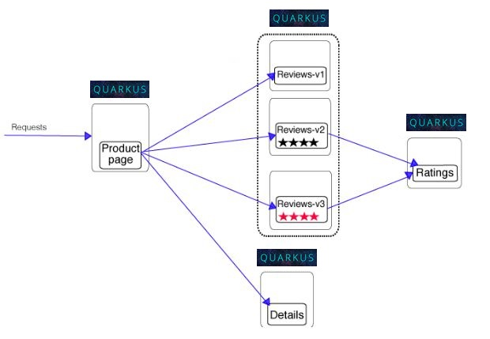

# ISTIO, HELP and QAURKUS demo app
The use case is taken from [official ISTO Examples page](https://istio.io/docs/examples/)
## REST EASY quarkus app
Setup is generated through maven architype and taken from the [Official QUARKUS page](https://quarkus.io/guides/getting-started-guide)
## Help charts 
The setup is taken from [KataCoda ISTO course](https://www.katacoda.com/courses/istio/deploy-istio-on-kubernetes)
## About ISTIO routing rules on this example

- The BookInfo product page sample application deployed is composed of four microservices:
- The productpage microservice is the homepage, populated using the details and reviews microservices.
- The details microservice contains the book information.
- The reviews microservice contains the book reviews. It uses the ratings microservice for the star rating.
- The ratings microservice contains the book rating for a book review.

The deployment included three versions of the reviews microservice to showcase different behaviour and routing:

- Version v1 doesn’t call the ratings service.
- Version v2 calls the ratings service and displays each rating as 1 to 5 black stars.
- Version v3 calls the ratings service and displays each rating as 1 to 5 red stars.

The services communicate over HTTP using DNS for service discovery. An overview of the architecture is shown below.

## end user identity with keycloak
The two main objects for configuring Istio's security policies are the Policy and DestinationRule object. Policy objects are used to configure the security settings of a service (or group of services). A DestinationRule in Istio is always used to configure how clients talk to a service

- [Increasing Security with a Service Mesh](https://www.infoq.com/articles/istio-security-mtls-jwt)
- [some example setting up keycloak on istio](https://github.com/kameshsampath/istio-keycloak-demo)